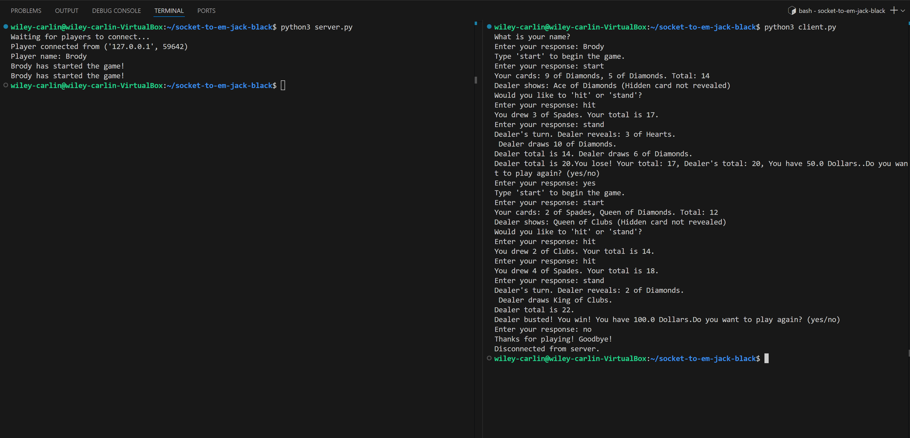

# Black Jack server README

## Video
[Untitled Video February 27, 2025 10_41 AM.webm](https://github.com/user-attachments/assets/267c58ef-2492-4ada-b4f9-5e5c33eb40ca)

## Overview
This is a simple network game of Black Jack by using Python. It allows a single player to connect and play against the dealer. 
## Features
- Supports single player
- Uses a shuffled deck of 52
- Uses normal Black Jack standards like hit, stand, and a money feature
- Dealer hits on 16 and lower and stands on 17+
- Normal Black Jack rules
## Requirements
- Python 3.x

## How to run the script
1. Open the terminal and run...
```
python3 server.py
```
2. The server should be ready for the client to connect so in a seperate terminal do the command...
```
python3 client.py
```
## User Responses:
All the responses that a user would imput are...
```
(Desired Name)
```
```
start
```
```
hit
```
```
stand
```
And when prompted "Do you want to play again (yes/no)? If a user's response has "no" in it, the game ends, otherwise a new game is prompted.
## How do you play Black Jack?
Official Rules of Black Jack: https://bicyclecards.com/how-to-play/blackjack

The game starts by giving you 2 cards and a number card 2-10 will be EQUAL to its number, ALL face cards are worth 10 and Aces can be used as 11 or 1 based on if you're total exceeds 21. Lets say you get 2 cards a 9 and a 2 now you have 11 you are givin the option to "hit" or "stand". Hit means you can get another random card, lets say you get a Jack (equal to 10) now you have 20 you should stand because if you go over 21 you lose! When you enter stand, your score is locked in, then you see what score the dealer got. The goal is to try and get the cards equal to 21? Give it a try!
## Notes
- Only one person can play at once
